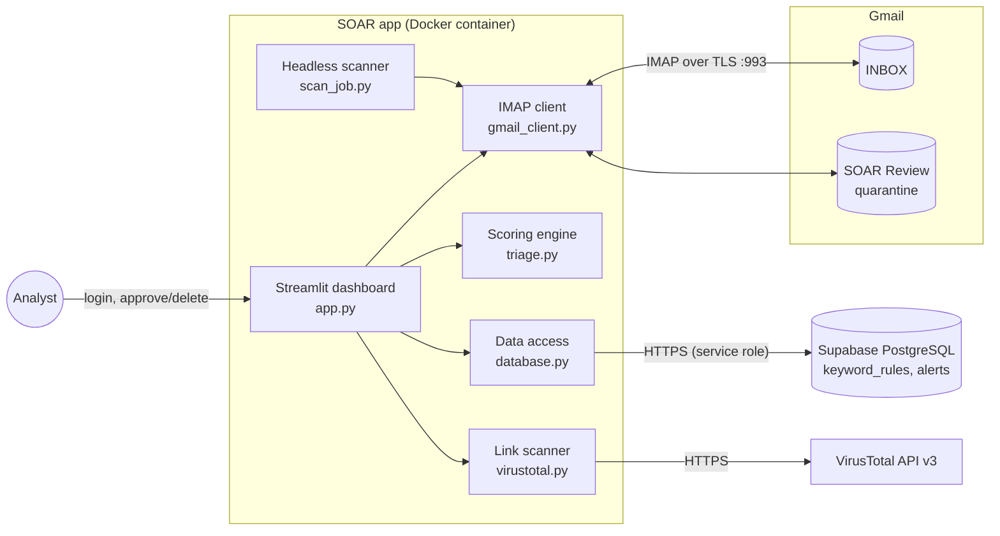
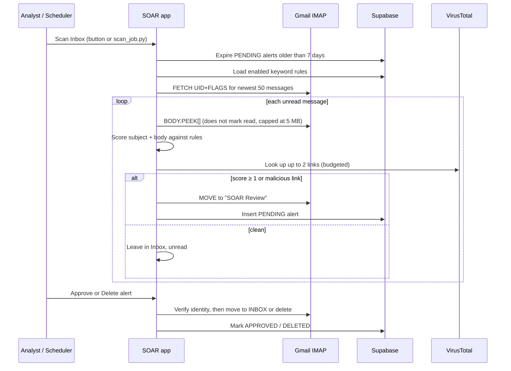
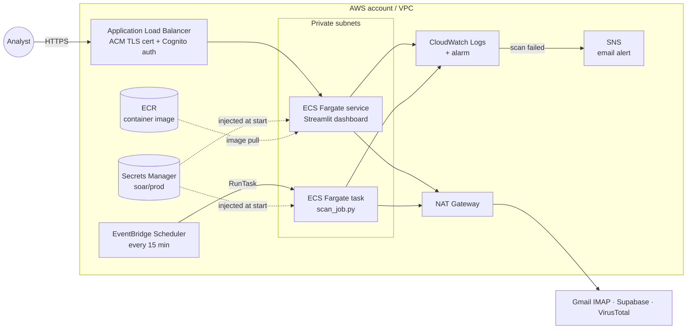

# SOAR Email Triage Platform

A lightweight **Security Orchestration, Automation, and Response (SOAR)** tool for Gmail. It automatically scans incoming mail, scores it for phishing indicators, checks embedded links against **VirusTotal**, quarantines suspicious messages, and gives an analyst a dashboard to **approve** or **delete** each one.

> **In one sentence:** it does the first pass of a SOC analyst's phishing triage automatically, and keeps a human in the loop for the final call.

| | |
|---|---|
| **Language** | Python 3.11 |
| **UI** | Streamlit dashboard |
| **Data** | Supabase (managed PostgreSQL) |
| **Integrations** | Gmail (IMAP over TLS), VirusTotal API v3 |
| **Deployment** | Docker / Docker Compose locally; AWS ECS Fargate in the cloud ([see AWS section](#deploying-on-aws)) |
| **Tests** | 44 unit tests (`unittest`), including security regression tests |

---

## Table of contents

1. [What problem it solves](#what-problem-it-solves)
2. [Key features](#key-features)
3. [Architecture](#architecture)
4. [How a scan works](#how-a-scan-works)
5. [Security design](#security-design)
6. [Data model](#data-model)
7. [Project layout](#project-layout)
8. [Running locally](#running-locally)
9. [Using the dashboard](#using-the-dashboard)
10. [Deploying on AWS](#deploying-on-aws)
11. [Testing](#testing)
12. [Troubleshooting](#troubleshooting)
13. [Roadmap](#roadmap)

---

## What problem it solves

Phishing is still the most common way attackers get into organizations. Security teams triage reported emails by hand: read the message, look for social-engineering language, check every link, then decide whether to release or destroy it. That is slow and repetitive.

This platform automates the repetitive parts and follows the standard SOAR pattern:

| SOAR stage | What this project does |
|------------|------------------------|
| **Ingest** | Pulls unread mail from Gmail over IMAP (without marking it read). |
| **Enrich** | Scores the message against configurable keyword rules and looks up its links on VirusTotal. |
| **Contain** | Moves suspicious mail out of the Inbox into a `SOAR Review` quarantine folder. |
| **Respond** | An analyst approves (release to Inbox) or deletes (destroy) from the dashboard. |
| **Maintain** | Stale alerts auto-expire after 7 days; cleanup tools keep the database small. |

---

## Key features

- **Configurable detection rules.** Add, edit, enable or disable, and delete weighted keywords (weight 1–10) from the UI, with no code changes or redeploys.
- **Threat scoring.** Each email's score is the sum of the weights of the rules it matches. Anything scoring ≥ 1 is quarantined.
- **Link reputation.** Extracts URLs from plain text *and* HTML `href`/`src` attributes, then queries VirusTotal. Malicious links trigger quarantine even if no keyword matched.
- **Safe quarantine.** Uses IMAP `MOVE` where available, falling back to COPY → verify → DELETE so a message is never removed before its copy exists.
- **Human-in-the-loop response.** Per-alert Approve, Delete (with confirmation), and Rescan VirusTotal actions.
- **Retention and cleanup.** Pending alerts older than 7 days go back to the Inbox automatically. Sidebar tools purge resolved alerts.
- **Headless mode.** `scan_job.py` runs the same pipeline without the UI, for cron or AWS EventBridge schedules.
- **Security hardened.** Validated IMAP input, a locked-down database, an authenticated dashboard, and escaped rendering of untrusted email content ([details](#security-design)).

---

## Architecture



### Components

| Module | Responsibility |
|--------|----------------|
| `app.py` | Streamlit UI and orchestration: the login gate, scan, approve, delete, rescan, and cleanup. |
| `scan_job.py` | Command-line entry point that runs one scan and exits (for schedulers). |
| `gmail_client.py` | IMAP session management, message parsing, quarantine moves, and deletes. Validates all UIDs and Message-IDs before they reach IMAP. |
| `triage.py` | Pure scoring function: case-insensitive keyword and phrase matching, summed weights. |
| `virustotal.py` | URL extraction (text and HTML attributes) and rate-limited VirusTotal lookups. |
| `database.py` | All Supabase reads and writes, through parameterized client calls. |
| `config.py` | Loads and validates environment configuration. Rejects public Supabase keys. |
| `logger.py` | Structured stdout logging, with secret redaction and email masking. |

### Design decisions

- **Separation of concerns.** The UI never talks to IMAP or the database directly; each external system sits behind one module. That keeps the scoring engine pure and easy to unit test.
- **Rules live in the database, not in code.** Analysts tune detections live, and every scan reloads the rules, so a change takes effect on the next run.
- **Peek, don't read.** Messages are fetched with `BODY.PEEK[]`, so clean mail stays unread for the user.
- **IMAP UIDs are per folder.** After a move, the destination UID is resolved by Message-ID and verified before any later approve or delete acts on it.
- **Budgeted enrichment.** VirusTotal lookups are capped per email and per scan, and stop on HTTP 429, so they stay inside the free-tier rate limits.

---

## How a scan works



---

## Security design

A security tool that processes attacker-controlled email has to be robust against that email. These controls are built in:

| Threat | Mitigation | Where |
|--------|------------|-------|
| **IMAP command injection** through a crafted `Message-ID` header (spaces or CRLF smuggling extra search terms or commands) | Message-IDs must match a strict `<printable-ascii>` pattern, are quoted in `SEARCH`, and must match exactly. Malformed IDs are discarded. | `gmail_client._safe_message_id` |
| **Tampered UIDs** reaching `STORE`/`MOVE`/`COPY` | Every UID is checked against `^\d+$` before use. | `gmail_client._require_uid` |
| **Approve/Delete hijack** through a spoofed duplicate Message-ID | The stored UID is used only if the message there still has the expected Message-ID. Fallback lookups must match exactly one message, otherwise the action fails closed. | `GmailClient._resolve_uid` |
| **Open database** (Supabase anon key is public by design) | RLS is enabled with no policies and grants are revoked from `anon`/`authenticated`. The app uses the server-side service-role key and refuses to start with an anon key. | `schema.sql`, `fix_grants.sql`, `config.py` |
| **Markdown injection** (tracking pixels or phishing links in subjects rendered in the dashboard) | All email-derived text is markdown-escaped. Untrusted URLs render as plain text, and only `https://www.virustotal.com/gui/url/…` links become clickable. | `app.md_escape`, `render_alert_card` |
| **Unauthenticated dashboard** | `APP_PASSWORD` login (constant-time compare, failure delay). Compose binds to `127.0.0.1` only. | `app.require_login`, `docker-compose.yml` |
| **Resource exhaustion** from huge or pathological emails | Partial fetch capped at 5 MB; HTML capped before regex processing. | `gmail_client.py` |
| **Secrets in logs** | Configured secret values are redacted from every log line; the Gmail address is masked. Error details go to logs, not the UI. | `logger.py`, `app.py` |
| **Container breakout blast radius** | Runs as a non-root user (`uid 10001`); tests are not shipped in the image. | `Dockerfile` |
| **Supply-chain drift** | Dependencies pinned to exact versions. | `requirements.txt` |

---

## Data model

**`keyword_rules`**: the detection logic.

| Column | Type | Notes |
|--------|------|-------|
| `id` | UUID | Primary key |
| `keyword` | TEXT | Word or phrase, matched case-insensitively |
| `weight` | INT | 1–10, enforced by a `CHECK` constraint |
| `enabled` | BOOL | Disabled rules are ignored |

**`alerts`**: one row per quarantined email.

| Column | Type | Notes |
|--------|------|-------|
| `gmail_uid` | TEXT | Primary key; UID in the `SOAR Review` folder |
| `message_id`, `sender`, `subject` | TEXT | Email metadata (no bodies are stored) |
| `threat_score`, `matched_keywords` | INT, TEXT[] | Triage result |
| `vt_score`, `vt_malicious`, `vt_suspicious`, `vt_total`, `vt_urls`, `vt_link` | mixed | VirusTotal enrichment |
| `status` | TEXT | `PENDING` → `APPROVED` or `DELETED` |
| `created_at`, `updated_at` | TIMESTAMPTZ | Audit timestamps |

Email bodies are **never** written to the database. They are fetched from Gmail on demand when an analyst opens an alert.

---

## Project layout

```text
app.py                 Streamlit UI + scan / approve / delete orchestration
scan_job.py            Headless one-shot scan (cron / AWS EventBridge)
config.py              Environment loading + validation
database.py            Supabase access for rules and alerts
gmail_client.py        Hardened IMAP client (peek, move, folder create, parse)
triage.py              Keyword scoring engine
virustotal.py          URL extraction + VirusTotal lookups
logger.py              Logging with secret redaction
diagnose_inbox.py      Live inbox / rules diagnostic CLI
schema.sql             Full Supabase schema, locked-down RLS, seed rules
fix_grants.sql         Lock-down migration for databases created by older schema
migrate_vt.sql         Adds VirusTotal columns to an older alerts table
seed_rules.sql         Optional keyword seed only
Dockerfile             Non-root Python 3.11 image
docker-compose.yml     Local single-service deployment (localhost only)
tests/                 Unit tests (triage, IMAP parsing, scan pipeline, VT, security)
```

---

## Running locally

### Prerequisites

- A [Supabase](https://supabase.com/) project
- A Gmail account with **IMAP enabled** and a [Google App Password](https://myaccount.google.com/apppasswords) (use a dedicated or test mailbox while experimenting)
- Docker, **or** Python 3.11+
- Optional: a [VirusTotal API key](https://www.virustotal.com/gui/my-apikey) (the free tier works)

### 1. Configure the environment

```bash
cp .env.example .env
```

| Variable | Required | Description |
|----------|----------|-------------|
| `SUPABASE_URL` | Yes | `https://<project>.supabase.co` |
| `SUPABASE_KEY` | Yes | The **service_role / secret** key (Project Settings → API). The anon key is rejected. |
| `GMAIL_USER` | Yes | Gmail address to triage |
| `GMAIL_APP_PASSWORD` | Yes | 16-character Google App Password |
| `APP_PASSWORD` | Yes | Dashboard login password, at least 12 characters |
| `VIRUSTOTAL_API_KEY` | No | Turns on link scanning |

`.env` is gitignored. Never commit it.

### 2. Create the database

In the Supabase SQL Editor, run **`schema.sql`**. It creates both tables, locks them down to the service role, and seeds starter phishing keywords.

> **Upgrading an older install?** Run **`fix_grants.sql`** to remove the old allow-all policies, run `migrate_vt.sql` if your `alerts` table predates VirusTotal support, then switch `SUPABASE_KEY` to the service-role key and add `APP_PASSWORD`.

### 3. Start the app

```bash
docker compose up --build
```

Open **http://localhost:8501** and sign in with your `APP_PASSWORD`.

Without Docker:

```bash
pip install -r requirements.txt
streamlit run app.py
```

---

## Using the dashboard

1. **Detection Rules (sidebar):** review and tune keywords and weights.
2. **Scan Inbox:** triages unread mail among the newest 50 Inbox messages.
3. **Pending Alerts:** each card shows the sender, subject, threat score, VirusTotal result, and matched keywords. Filter by sender or subject; sort by date or score.
4. **View email body:** loads the quarantined message from Gmail on demand, rendered as plain text.
5. **Rescan VT:** re-extracts links and refreshes the VirusTotal verdict.
6. **Approve:** releases the email back to the Inbox (`APPROVED`).
7. **Delete:** permanently removes it from Gmail after a confirmation (`DELETED`).
8. **Database Cleanup (sidebar):** alert counts, purging resolved alerts, clearing VT payloads, expiring stale pending alerts now, and clearing orphaned pending rows (for mail you already handled directly in Gmail).

### Scoring

- Rules are matched case-insensitively against the subject and body, including links preserved from HTML.
- The threat score is the sum of the weights of the matched enabled rules. Quarantine happens at **score ≥ 1** or on any VirusTotal-malicious link.
- The UI shows VirusTotal results like `3/70 malicious`, or `n/a` with a reason when there were no links or no key.

---

## Deploying on AWS

The app is a single container, so it maps cleanly onto AWS managed services. This section explains the target architecture and then walks through deploying it step by step.

### Target architecture



| AWS service | Role in this platform | Replaces locally |
|-------------|-----------------------|------------------|
| **ECR** | Private registry for the Docker image | `docker build` |
| **ECS on Fargate** | Runs the dashboard container with no servers to manage | `docker compose up` |
| **Application Load Balancer + ACM** | HTTPS termination; supports the WebSockets Streamlit needs | `localhost:8501` |
| **Amazon Cognito (on the ALB)** | SSO-style login (with optional MFA) *before* traffic reaches the app, layered on top of `APP_PASSWORD` | `APP_PASSWORD` only |
| **Secrets Manager** | Stores the Supabase, Gmail, VirusTotal, and app secrets; ECS injects them as environment variables at startup, so no `.env` file is needed | `.env` |
| **EventBridge Scheduler** | Runs `scan_job.py` on a schedule, making triage fully automated | Clicking **Scan Inbox** |
| **CloudWatch Logs + Alarms + SNS** | Centralized logs; emails you when a scheduled scan fails | `docker logs` |
| **IAM** | Least-privilege roles: the task can read only its own secret and write only its own logs | n/a |

**Why this design:** there are no servers to patch (Fargate), no secrets on disk (Secrets Manager), two independent authentication layers (Cognito and `APP_PASSWORD`), automated scanning (EventBridge), and failure alerting (CloudWatch → SNS). The app containers run in private subnets and reach the outside world only through NAT for outbound calls.

### Step-by-step method

The steps use the AWS CLI v2. Replace `<ACCOUNT_ID>` and `<REGION>` with your values. Each step can also be done in the AWS Console or expressed as Terraform/CDK.

**1. Push the image to ECR**

```bash
aws ecr create-repository --repository-name soar-platform
aws ecr get-login-password --region <REGION> \
  | docker login --username AWS --password-stdin <ACCOUNT_ID>.dkr.ecr.<REGION>.amazonaws.com

docker buildx build --platform linux/amd64 \
  -t <ACCOUNT_ID>.dkr.ecr.<REGION>.amazonaws.com/soar-platform:latest --push .
```

**2. Store the secrets in Secrets Manager**

```bash
aws secretsmanager create-secret --name soar/prod --secret-string '{
  "SUPABASE_URL": "https://<project>.supabase.co",
  "SUPABASE_KEY": "<service-role-key>",
  "GMAIL_USER": "<you>@gmail.com",
  "GMAIL_APP_PASSWORD": "<app-password>",
  "APP_PASSWORD": "<long-random-password>",
  "VIRUSTOTAL_API_KEY": "<vt-key>"
}'
```

**3. Create the IAM execution role.** ECS uses this role to pull the image, write logs, and read the secret. Attach the managed `AmazonECSTaskExecutionRolePolicy` plus an inline policy scoped to this one secret:

```json
{
  "Version": "2012-10-17",
  "Statement": [{
    "Effect": "Allow",
    "Action": "secretsmanager:GetSecretValue",
    "Resource": "arn:aws:secretsmanager:<REGION>:<ACCOUNT_ID>:secret:soar/prod-*"
  }]
}
```

**4. Register the task definition.** Each secret key is mapped to an environment variable, so `config.py` reads it exactly as it reads `.env` locally, with no code changes:

```json
{
  "family": "soar-platform",
  "requiresCompatibilities": ["FARGATE"],
  "networkMode": "awsvpc",
  "cpu": "512",
  "memory": "1024",
  "executionRoleArn": "arn:aws:iam::<ACCOUNT_ID>:role/soarTaskExecutionRole",
  "containerDefinitions": [{
    "name": "soar",
    "image": "<ACCOUNT_ID>.dkr.ecr.<REGION>.amazonaws.com/soar-platform:latest",
    "portMappings": [{ "containerPort": 8501 }],
    "secrets": [
      { "name": "SUPABASE_URL",       "valueFrom": "arn:aws:secretsmanager:<REGION>:<ACCOUNT_ID>:secret:soar/prod:SUPABASE_URL::" },
      { "name": "SUPABASE_KEY",       "valueFrom": "arn:aws:secretsmanager:<REGION>:<ACCOUNT_ID>:secret:soar/prod:SUPABASE_KEY::" },
      { "name": "GMAIL_USER",         "valueFrom": "arn:aws:secretsmanager:<REGION>:<ACCOUNT_ID>:secret:soar/prod:GMAIL_USER::" },
      { "name": "GMAIL_APP_PASSWORD", "valueFrom": "arn:aws:secretsmanager:<REGION>:<ACCOUNT_ID>:secret:soar/prod:GMAIL_APP_PASSWORD::" },
      { "name": "APP_PASSWORD",       "valueFrom": "arn:aws:secretsmanager:<REGION>:<ACCOUNT_ID>:secret:soar/prod:APP_PASSWORD::" },
      { "name": "VIRUSTOTAL_API_KEY", "valueFrom": "arn:aws:secretsmanager:<REGION>:<ACCOUNT_ID>:secret:soar/prod:VIRUSTOTAL_API_KEY::" }
    ],
    "logConfiguration": {
      "logDriver": "awslogs",
      "options": {
        "awslogs-group": "/ecs/soar-platform",
        "awslogs-region": "<REGION>",
        "awslogs-stream-prefix": "soar",
        "awslogs-create-group": "true"
      }
    }
  }]
}
```

```bash
aws ecs register-task-definition --cli-input-json file://taskdef.json
```

**5. Run the dashboard behind an ALB**

```bash
aws ecs create-cluster --cluster-name soar
aws ecs create-service --cluster soar --service-name soar-dashboard \
  --task-definition soar-platform --desired-count 1 --launch-type FARGATE \
  --network-configuration "awsvpcConfiguration={subnets=[<private-subnet-ids>],securityGroups=[<task-sg>],assignPublicIp=DISABLED}" \
  --load-balancers "targetGroupArn=<tg-arn>,containerName=soar,containerPort=8501"
```

- Target group: protocol HTTP, port 8501, health check path `/_stcore/health`.
- HTTPS listener: an ACM certificate, with an `authenticate-cognito` action ahead of the forward to the target group.
- Security groups: the ALB accepts 443 only from trusted IPs; the task accepts 8501 **only from the ALB's security group**.
- Keep `desired-count` at 1, or turn on target group stickiness, because Streamlit sessions are stateful.

**6. Schedule automated scans with EventBridge.** This reuses the same image and task definition and only overrides the command:

```bash
aws scheduler create-schedule --name soar-scan-every-15m \
  --schedule-expression "rate(15 minutes)" \
  --flexible-time-window Mode=OFF \
  --target '{
    "Arn": "arn:aws:ecs:<REGION>:<ACCOUNT_ID>:cluster/soar",
    "RoleArn": "arn:aws:iam::<ACCOUNT_ID>:role/soarSchedulerRole",
    "EcsParameters": {
      "TaskDefinitionArn": "arn:aws:ecs:<REGION>:<ACCOUNT_ID>:task-definition/soar-platform",
      "LaunchType": "FARGATE",
      "NetworkConfiguration": { "awsvpcConfiguration": {
        "Subnets": ["<private-subnet-id>"], "SecurityGroups": ["<task-sg>"], "AssignPublicIp": "DISABLED" } }
    },
    "Input": "{\"containerOverrides\":[{\"name\":\"soar\",\"command\":[\"python\",\"scan_job.py\"]}]}"
  }'
```

`soarSchedulerRole` needs `ecs:RunTask` on the task definition and `iam:PassRole` for the execution role.

**7. Alert on failures**

```bash
aws logs put-metric-filter --log-group-name /ecs/soar-platform \
  --filter-name soar-scan-failures --filter-pattern '"Scheduled scan failed"' \
  --metric-transformations metricName=SoarScanFailures,metricNamespace=SOAR,metricValue=1

aws sns create-topic --name soar-alerts
aws sns subscribe --topic-arn <topic-arn> --protocol email --notification-endpoint <you@example.com>

aws cloudwatch put-metric-alarm --alarm-name soar-scan-failed \
  --namespace SOAR --metric-name SoarScanFailures --statistic Sum \
  --period 900 --evaluation-periods 1 --threshold 1 \
  --comparison-operator GreaterThanOrEqualToThreshold --alarm-actions <topic-arn>
```

### Cost and alternatives

- A rough baseline is one small Fargate task, an ALB, and a NAT Gateway. The ALB and NAT make up most of the cost, so check current AWS pricing for your region.
- **Cheaper single-user option:** run the same container on one small **EC2** or **Lightsail** instance with Docker Compose. Keep port 8501 closed and reach it through an SSH tunnel or **AWS Systems Manager Session Manager** port forwarding, and use **cron** with `python scan_job.py` instead of EventBridge.
- **All-AWS data tier:** Supabase could be replaced with **Amazon RDS for PostgreSQL**, using the same schema. That would mean swapping the Supabase client in `database.py` for a PostgreSQL driver such as `psycopg`. The module boundary keeps that change contained.

---

## Testing

```bash
# Unit tests (no network or credentials needed)
python -m unittest discover -s tests -v

# Live diagnostic: rules, SOAR Review folder, unread vs read mail, scores
python diagnose_inbox.py
```

| Suite | Covers |
|-------|--------|
| `test_triage.py` | Scoring, phrase matching, disabled rules, weights |
| `test_scan_pipeline.py` | End-to-end scan decisions with mocked Gmail and DB, lookback window |
| `test_mailbox_parsing.py` | IMAP LIST parsing and mailbox quoting |
| `test_virustotal.py` | URL extraction from text and HTML, VT result handling |
| `test_security.py` | IMAP injection payloads, UID validation, duplicate Message-ID handling, Supabase key-role detection, log redaction |

---

## Troubleshooting

| Symptom | Likely cause | What to try |
|---------|--------------|-------------|
| "SUPABASE_KEY is the public anon/publishable key" | Using the anon key | Switch to the service-role / secret key; run `fix_grants.sql` on older databases |
| "APP_PASSWORD must be set" | Missing or short login password | Add `APP_PASSWORD` (≥ 12 characters) to `.env`, then restart |
| Permission denied / empty data from Supabase | Old allow-all policies removed but still on the anon key | Use the service-role key |
| IMAP auth failed | Wrong App Password, or IMAP is off | Create a new App Password; enable IMAP in Gmail settings |
| Scan finds nothing | Mail already read, or not among the newest 50 | Mark the test mail **unread** and keep it recent in the Inbox |
| "Could not locate the quarantined message" | Mail was moved or deleted directly in Gmail | Use **Clear pending alerts** in Database Cleanup |
| VirusTotal always `n/a` | No key, alert predates VT, or no links | Set the key, restart, click **Rescan VT** |
| DB insert errors on `vt_*` | Schema not migrated | Run `migrate_vt.sql` |

---

## Roadmap

- Sender and domain reputation (SPF/DKIM/DMARC results, lookalike-domain detection)
- Attachment hashing with VirusTotal file lookups
- Audit log of analyst actions (who approved or deleted what, and when)
- Infrastructure as code (Terraform/CDK) for the AWS deployment above
- Slack or Teams notifications for new high-score alerts

---

## License

Free to use and modify for personal learning and local security tooling.
